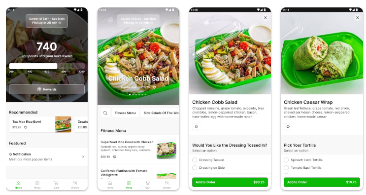

# 🍽️ Garden of Eat'n — Smart Restaurant App

  <!-- 👤 PROFILE PICTURE PLACEHOLDER -->
  

  <b>Mpayimana Cyiza Landry</b> 
  Senior Software Engineer — Dev Protocol

---

## 🌿 About the App

**Garden of Eat'n** is a modern restaurant mobile application designed to make dining simple, fast, and enjoyable.

From discovering delicious meals to tracking your order in real-time, the app brings the full restaurant experience straight to your phone.

---

## ✨ What Users Can Do

### 🧾 Browse the Menu  
Explore the restaurant’s full menu with beautiful categories, clear descriptions, and pricing — all in one place.

### 🛒 Place Orders  
Select your favorite meals, customize your order, add to cart, and place your order in seconds.

### 🕒 Track Orders in Real-Time  
Watch your order move from:
**Placed → Confirmed → Preparing → Ready → Out for Delivery → Delivered**  
with live updates on your screen.

### 🪑 Make Table Reservations  
Reserve a table by choosing your preferred date, time, and number of guests — no phone calls required.

### 📲 Get Instant Notifications  
Stay informed about your order status and reservation confirmations without opening the app repeatedly.

---

## 🧑‍🍳 Why Users Love It

✔ Fast & easy ordering  
✔ No waiting on phone calls  
✔ Clear order progress updates  
✔ Smooth reservation experience  
✔ Beautiful, simple design

---

## 📸 App Preview

  <!-- 🖼️ APP SCREENSHOT PLACEHOLDER -->
  

---

## 🧑‍💻 Developer

**Mpayimana Cyiza Landry**  
Senior Software Engineer — **Dev Protocol**
---
